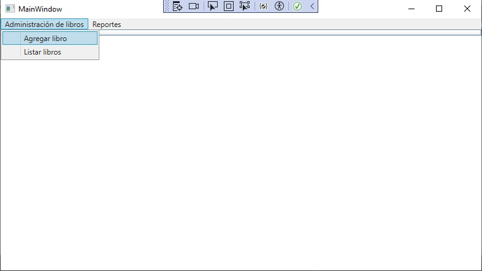
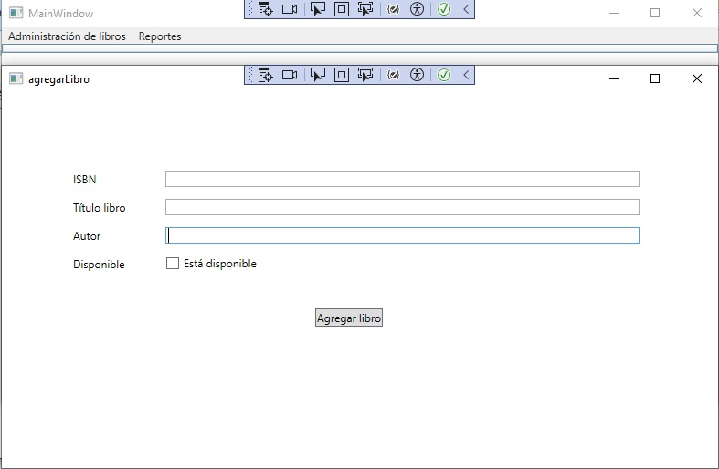
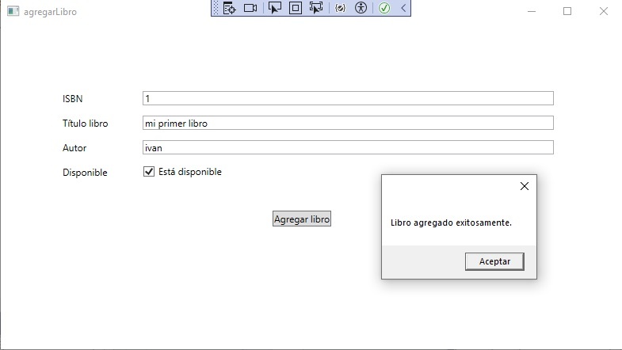
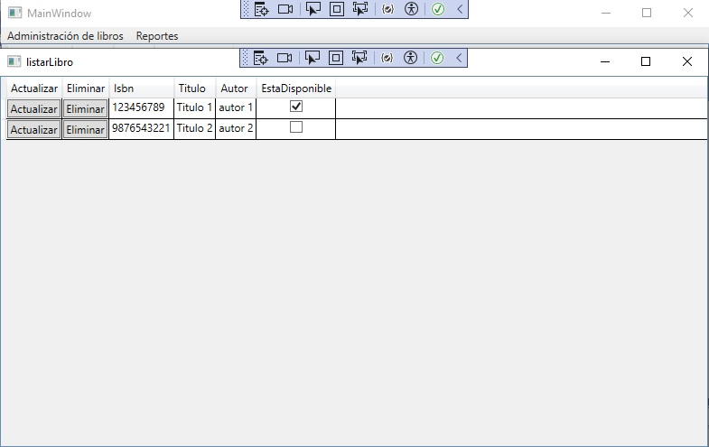

# Librería WPF

## Descripción

Esta es una aplicación de escritorio para la gestión de una librería, desarrollada en WPF (Windows Presentation Foundation). WPF permite la creación de interfaces de usuario sofisticadas y dinámicas utilizando un lenguaje de marcado llamado XAML (Extensible Application Markup Language).

## Imágenes Principales

## Características Actuales

- **Agregar Libros**: Permite añadir nuevos libros a la colección.
- **Listar Libros**: Muestra todos los libros disponibles en la colección.
- **Actualizar Libros**: Permite modificar la información de los libros existentes.
- **Eliminar Libros**: Permite eliminar libros de la colección.
## Estructura del Proyecto
- **MainWindow.xaml**: Contiene el menú principal con opciones para agregar y listar libros.
- **agregarLibro.xaml**: Ventana para agregar nuevos libros.
- **listarLibro.xaml**: Ventana para listar, actualizar y eliminar libros.
- **actualizarLibro.xaml**: Ventana para actualizar la información de un libro existente.

## Futuro Desarrollo

- **Conexión a Base de Datos**: En futuras versiones, se integrará la aplicación con una base de datos para almacenar los datos de manera persistente.
- **Seguridad**: Se agregarán funcionalidades de autenticación y autorización para asegurar el acceso a la aplicación.

- **Optimización y Nuevas Características**: Mejoras en la interfaz y nuevas características basadas en comentarios y necesidades de los usuarios.
